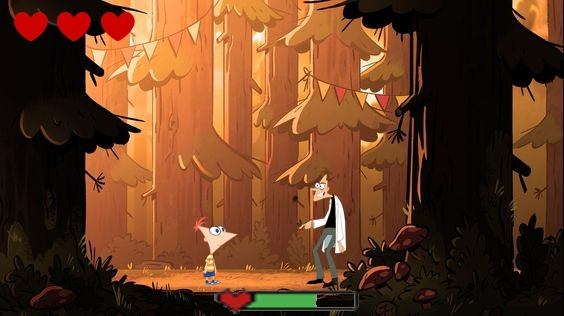
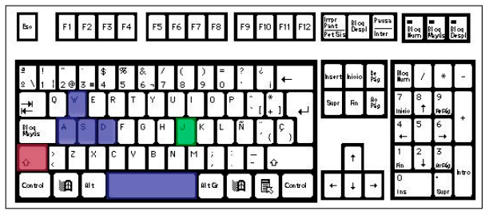
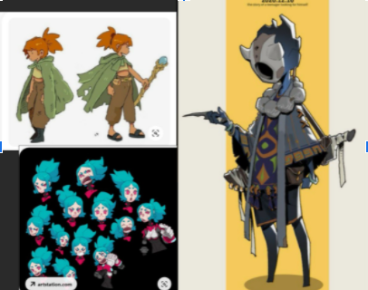
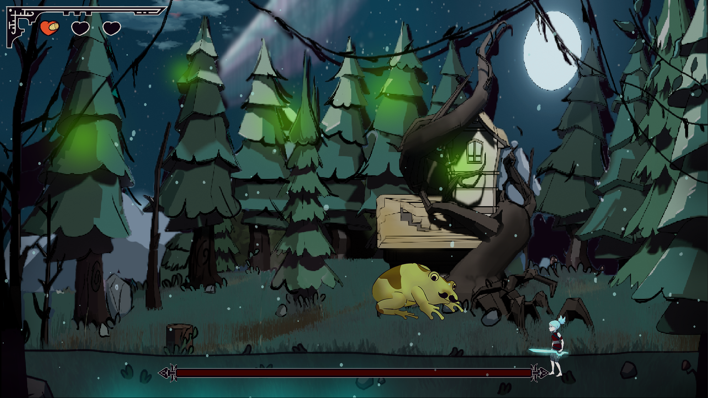
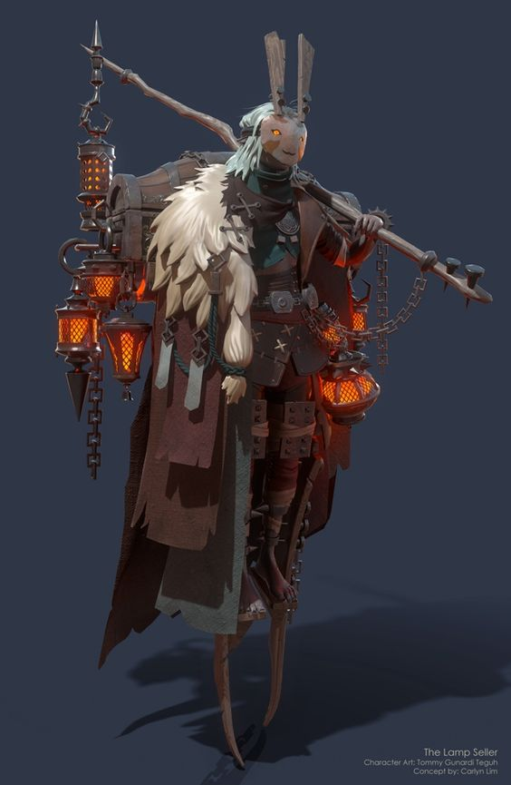
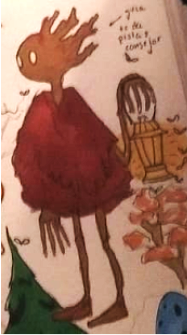
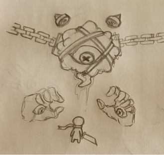
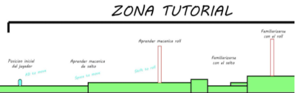
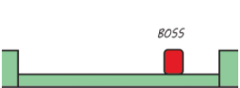

# VERDANT SORROW

***Documento de diseño de videojuego***

**Nombre de la empresa**: *Xuppap Inc.*

**Integrantes y correos**: *Daniel Martín Gómez (damart24@ucm.es), Miriam Martín Sánchez (mirima10@ucm.es), Javier Callejo Herrero (jacall02@ucm.es), Laura Gómez Bodego (lgomez25@ucm.es),  Nacho Del Castillo (igdelcas@ucm.es), Javier Muñoz García (javimuno@ucm.es), José María Gómez Pulido (jgomez18@ucm.es),Paula Morillas Alonso (pamorill@ucm.es), Rodrigo Sánchez Torres (rodsan05@ucm.es), Sergio Baña Marchante (sebana@ucm.es).  
Versión 1 - 30 de enero de 2022*

| Resumen||
:--: | :--: 
Géneros | Souls-Like, Acción, Aventuras, Boss-rush 
Modo | Single-player
Público Objetivo | Edad: 15-30 años
||Sexo: todos
||Idioma: español
Plataformas|Windows
---

**Tabla de contenidos**

1. [Aspectos generales](#aspectos-generales)   
    1.1. [Relato breve y parcial de una partida típica](#relato-breve)
2. [Jugabilidad](#jugabilidad)  
    2.1. [Mecánica](#mecanica)  
        2.1.1. [Mecánicas del personaje](#mecanicas-del-personaje)  
        2.1.2. [Mecánicas de enemigos](#mecanicas-de-enemigos)    
    2.2. [Controles](#controles)  
    2.3. [Cámara](#camara)  
    2.4. [Dinámica](#dinamica)  
    2.5. [Estética](#estetica)  
3. [Menús y modos de juego](#menus-y-modos-de-juego)  
    3.1. [Configuración](#configuracion)  
    3.2. [Interfaz y control](#interfaz-y-control)
4. [Breve descripción del sistema y plataforma de gestión](#descripion-del-sistema)  
5. [Contenido](#contenido)  
    5.1. [Música](#musica)  
    5.2. [Sonidos](#sonidos)  
    5.3. [Imágenes](#imagenes)  
    5.4. [Historia](#historia)  
    5.5. [Niveles](#niveles)   
6. [Referencias](#referencias)
___

## 1. Aspectos Generales

Vista General |
:--:|
|

###  1.1. Relato breve y parrcial de una partida típica   
El jugador realiza el tutorial, lo que le enseña las mecánicas básicas y además le enseña que puede matar moscas y atravesar raíces rodando. 

Tras eso sale al hub. Allí podrá hablar con distintos NPCs que explican la historia brevemente y además alguno le menciona su primer objetivo, la rana.

El jugador encuentra la zona en la que se encuentra la rana y entra para pelear contra ella. Al derrotarla sale a hub nuevamente para buscar el segundo objetivo, además, en el hub los NPCs tendrán nuevos diálogos referenciándolo.

Tras encontrar y derrotar al segundo jefe el jugador vuelve a repetir el ciclo de hablar y buscar al tercero.

Al derrotar al tercer jefe el jugador debe escapar en un nivel de plataformas a contrareloj. Al llegar al hub podrá finalmente abrir la puerta y descubrir qué se encuentra tras esta.

Se reproduce una cinemática final al abrir la puerta.

###  1.2. Duración esperada de una partida
El tiempo aproximado que debe durar una partida de un jugador novel se compone de:

- El tiempo que tarda en realizar el tutorial: aproximadamente unos **3-5 min**.
- El tiempo de búsqueda del jefe en el hub, teniendo en cuenta la lectura de los diálogos para poder acceder al jefe: aproximadamente unos **3-5 min**. Un total de 3 veces: unos **10-15 min**
- El tiempo de batalla contra la rana: aproximadamente unos **3 min** de pelea, es probable que se necesiten varios intentos, aproximadamente **3 intentos**. Total: unos **10 min**.
- El tiempo de batalla contra el árbol: aproximadamente unos **3 min** de pelea, es probable que se necesiten varios intentos, aproximadamente **2-3 intentos**. Total: unos **8 min**.
- El tiempo de batalla contra el ojo con manos: aproximadamente unos **3 min** de pelea, es probable que se necesiten varios intentos, aproximadamente **4 intentos**. Total: unos **12 min**.
- El tiempo que se tarda en superar el nivel de huída tras el tercer jefe: aproximadamente **1 min**.
- El tiempo que dura la cinemática final y algún diálogo extra: aproximadamente **3 min**.

Total del juego: unos **45 min**, esta duración asume que el jugador lee diálogos y requiere varios intentos por jefe, además la vida de los jefes puede ser ajustable, por lo tanto una medida algo más realista sería: unos **15-20 minutos** sin leer muchos diálogos, unos **25-30 minutos** leyendo todos los diálogos. La habilidad del jugador influye de forma significativa en esta duración.

---  
##  2. Jugabilidad  
###  2.1. Mecánica 
###  2.1.1. Mecánicas del personaje  

-Movimiento: El jugador podrá moverse hacia la izquierda o la derecha con un movimiento lateral a velocidad constante. Además podrá saltar.  

-Movimiento top down: El jugador podrá moverse en **X direcciones** en el hub.  

-Esquivar: El jugador podrá esquivar ataques, consiguiendo frames de invulnerabilidad durante la animación de esquivar.  

-Ataque: El personaje dará un barrido hacia delante con la espada, en vertical, de forma que el ataque es un **arco de la altura del jugador**. Te quedas quieto cuando estés atacando. El ataque hace 1 de daño.

-Vida: El jugador dispondrá de tres vidas, perdiendo una por cada golpe que reciba de un enemigo. Al recibir un golpe el jugador será impulsado hacia atrás y brillará en blanco.

###  2.1.2. Mecánicas de enemigos  

Comportamiento de los jefes: 
  - Jefe de la rana
      - Visual: Una rana quiere comer moscas con la lengua.
      - Primera fase:  
          - La rana va saltando de un lado a otro de la pantalla. Empieza saltando hacia la izquierda, calculando la distancia del salto aleatoriamente dentro de un intervalo.

          - La rana rebota con los bordes de la pantalla, en ese momento cambia la dirección del salto.

          - Ataque de la lengua: Cada X saltos(decidido aleatoriamente entre un intervalo), hace este ataque:
            - Aparece una mosca cerca del jugador, a una distancia determinada de la rana siempre a la misma distancia del suelo. Si la posición se sale de la pantalla, aparece en la otra dirección. La mosca aparece siempre a la altura del jugador.

            - X segundos después, la rana lanza la lengua hasta la posición x de la mosca y hace daño, y vuelve rápidamente. La lengua sale de forma horizontal.

            - Si matas a la mosca se enfada y realiza un ataque, un salto sobre sí mismo realizando una onda expansiva al caer. Tras este ataque se queda vulnerable durante un tiempo.

            - La onda expansiva se define como un proyectil que se mueve de forma horizontal desde la posición del boss hasta uno de los extremos de la pantalla, pegado al suelo a velocidad constante, de tamaño lo suficientemente pequeño para que pueda ser saltado por el jugador.

        - Segunda fase:
          - Mismo comportamiento que en la primera fase.

          - La rana se enfada y cambia de color (por ejemplo), ahora ataca al jugador.

          - Añade un nuevo ataque en que los saltos son el doble de alto y cada uno causa una onda expansiva.

          - En cada salto la rana tiene un 70% de probabilidad de hacer saltos pequeños y un 30% de hacer saltos grandes.

          - El ataque de la lengua cambiaria. Ahora la mosca no aparece antes de tirar la lengua, si no que siempre ataca siempre hacia el jugador de forma horizontal.
    - Árbol humanoide:
      - Visual: Groot con una lámpara.
      - Primera fase: 
        - Se va acercando hacia la posición x del jugador, y cuando está lo suficientemente cerca, manotazo a melee (un arco frente al jefe de diámetro igual a su alto, similar al jugador), se queda quieto un instante.

        - Ola de raíces: Tras un tiempo aleatorio en un intervalo, salen raíces del suelo progresivamente izquierda a derecha, separadas a la misma distancia cada una con un pequeño delay entre que sale una rama y otra. Cubriendo todo el alto de la pantalla. Antes de que salga una raíz, hay un indicador de una raíz pequeñita en la posición en la que va a salir la raíz.

        - Ataque raíces con auto-aim: Cada X segundos, elegidos aleatoriamente dentro de un intervalo. El boss se sale de pantalla, la lámpara se queda en mitad del ancho de la pantalla, y lo suficientemente alta para que el jugador no llegue. Las raíces del ataque anterior van saliendo en la posición del jugador cada X segundos. Si una de las raíces alcanza a la lámpara, se le hace mucho daño y se cambia a otro patrón de ataque.
        
      - Segunda fase: 
        - El boss ya no lleva la lámpara con él. La lámpara aparece en un lado de la pantalla.

        - Cuando recibe 3 golpes, cambia al otro lado de la pantalla. De forma que el boss siempre está al principio entre la lámpara y el jugador. Esto se repite 3-4 veces.

        - Al igual que en la primera fase, el boss persigue al jugador, y cuando lo tiene a rango, le pega un manotazo.

        - El ataque de raíces con auto-aim se realiza constantemente. Si la raíz sale cerca de la lámpara se cancela (el jefe no le pega a su lámpara).
    - Jefe de las manos: 
      - Visual: Un cuerpo principal (ojo, cabeza, mago…) que ataca con 2 manos gigantes.

      - Hay que subirse a las manos para atacar al cuerpo principal.

      - Las manos vuelven a su posición original tras cada ataque.

      - Tres ataques:
        - Clap: junta ambas manos hacia el centro de la pantalla rápidamente a ras de suelo.

        - Puñetazo: la mano se echa hacia atrás y mete un puñetazo rápido.

        - Martillazo: la mano choca contra el suelo, provoca una onda expansiva.
      
      - Las manos hacen daño sólo durante el ataque..

      - Segunda fase:
        - El boss se desencadena y comienza a moverse por la pantalla.

        - El resto de ataques siguen igual, solo que las manos ahora hacen daño por contacto siempre (se prenden).

        - El movimiento del cuerpo del boss es el siguiente: <a ref="https://www.youtube.com/watch?v=5mGuCdlCcNMMovimiento">Movimiento</a>

        - Cuando choca contra el suelo lanza una bola de fuego a cada lado y se queda inmóvil unos segundos.

        - Cada X tiempo lanza una bola de fuego hacia el jugador, que desaparece al chocar con un lateral de la pantalla o el suelo.

      - Tercera fase:
        Cámara scroll lateral hacia la derecha. El boss te persigue desde la izquierda y el jugador tendrá que correr hacia la derecha para huir.

###  2.2. Controles  
El jugador se controla con las teclas WASD del teclado (W se utiliza para saltar, al igual que la tecla Espacio, A y D para el movimiento lateral). Se atacará con la tecla J, y se esquivará con el Shift izquierdo.

  

###  2.3. Cámara  
La cámara estará posicionada de modo que se muestre una vista lateral del personaje y del escenario. Según el jugador vaya avanzando, la cámara lo seguirá con un cierto delay haciendo scroll, con el jugador siempre centrado en la cámara. En las peleas con los jefes la cámara está fija en el centro porque las zonas de combate ocupan una pantalla únicamente.

###  2.4. Dinámica  
- Objetivo: Avanzar a través de las diferentes zonas venciendo a los 3 jefes para abrir la puerta central.  

- Ganar: Acabar con el jefe actual.

- Recompensa: Nuevos caminos en el hub, nuevos diálogos y jefe.

- Perder: Morir en combate contra los jefes  

- Castigo: Volver al hub y tener que comenzar de nuevo el jefe.  

###  2.5. Estética

  
  

  

Se busca una estética inspirada principalmente en “Más allá del jardín”. Dibujos infantiles pero con una tonalidad oscura que nos puede recordar también a la estética de Tim Burton. Los personajes, enemigos y objetos con los que interactúa el jugador tendrán tonos con más saturación para poder distinguirlos del fondo. Todo el arte tendrá lineart negro, exceptuando zonas muy alejadas del fondo. En ciertos momentos se usará una composición uniforme con un elemento contrastado para captar la atención del jugador (por ejemplo cuando el jefe de la linterna sale de la pantalla la linterna contrasta con todo lo demás).

Esta será la paleta de colores que se utilizará.
 

  

---

##  3. Menús y modos de juego
###  3.1. Configuración

- Menú principal: Cuenta con los siguientes botones:
    - Nueva partida: Comienza una nueva partida.
    - Continuar: Continúa el juego en el último punto de guardado.
   -  Zonas: Te permite seleccionar un jefe contra el que luchar.
   -  Ajustes: Permite regular el volumen de salida de audio.
   -  Controles: Muestra una pantalla con los controles del juego.
   -  Salir: Permite salir del juego.
 
 - Menú de pausa: Cuenta con los siguientes botones:
    - Reanudar nivel: Permite reanudar la partida.
    - Ajustes: Permite regular el volumen de salida de audio.
    - Salir al menú principal: Permite volver al menú principal.
    - Salir : Permite cerrar el juego sin tener que salir al menú principal.

 Al utilizar las opciones de salir, el juego guardará el estado desde el último punto de guardado.

 ###  3.2. Interfaz y control  
 La interfaz será una interfaz sencilla; contendrá 3 corazones que representan la vida del jugador. Cada enemigo tendrá en la cabeza una barra que representa su vida. 

 

  

---

 ##  4. Breve descripción del sistema y plataforma de gestión  
 Utilizaremos GitHub Issues como sistema de gestión, cada historia de usuario se escribirá como una issue y los responsables se la asignarán.  

 ### 4.1. Breve descripción del sistema y plataforma de comunicación 
 Utilizaremos medios como Discord y/o WhatsApp para la comunicación efectiva entre todo el equipo y para acordar fechas y horas de reunión para aclarar dudas y posibles conflictos.  

---

  ##  5. Contenido  
  ###  5.1. Música  
  - Música de cada uno de los jefe.
  - Música menú.  

  ###  5.2. Sonidos
  - Jugador
    - Espadazo (suena cuando el jugador ataca)
    - Salto
    - Rodar 
  
  - General
    - GameOver
    - Derrotar Boss
  
  - Enemigos
  - Bosses

  ###  5.3. Imágenes
  - Personaje principal:
    - Correr
    - Saltar
    - Atacar (en suelo)
    - Atacar (en aire)
    - Rodar  
  
    |  

  - Boss rana:
    - Rana idle
    - Rana saltando
    - Rana sacando lengua
    - Rana vulnerable  

    |

  - Boss humanoide:
    - Idle
    - Caminar
    - Golpear

      
      

  - Boss manos:
    - Mano abierta/puño
    - Ojo central gigante

    |  

  ###  5.4. Historia  
  Durante los últimos milenios, el mundo de Arven vio cómo los poderes naturales que daban la noción de equilibrio al propio planeta y ayudaban a sus habitantes a prosperar y estar en armonía con el mundo mismo, iban pervirtiendose y transformándose en una mágica distinta, más egoísta, impersonal y codiciosa.  

  Las tres esencias primordiales del mundo y sus custodios se refugiaron en un bosque ancestral, un bosque sin nombre, donde los habitantes de este planeta vieron su luz por primera vez.  

  Terria, la esencia de toda la materia.  

  Lumine, la esencia de la luz y la vida.  

  Etheria, la esencia que constituye la voluntad y la mente.  

  El uso incontrolado de esta magia acabó con la paz que imperaba en el mundo, resultando en guerras por el control de sus terrenos y en rituales para succionar las energías primordiales y transformarlas en esta nueva magia arcana, si bien más poderosa, también destructiva en su descontrol.  

  Así pasó que, cuando desde diversos puntos del mundo la succión de la esencia del mundo fue desmedida e incontrolada, la magia que otrora sirviera a los propósitos de sus habitantes implosionó de manera global, borrando de la superficie todo cuando encontró a su paso, nada que hubiera tocado la magia sobrevivió.  

  Con este devastador suceso, tan solo los custodios de las esencias sobrevivieron, más no como ellos esperaban, sus nombres se olvidaron y su apariencia cambió, pasando a ser criaturas grotescas y furibundas cuyo único propósito es ahora ser las carceleras de las fuerzas primordiales.  

  El custodio de Terria se transformó en una gigantesca rana que consume todo cuanto está a su alcance.  

  El de Lumine se convirtió en un árbol viviente que encarceló la esencia de la luz en una lámpara cerrada.  

  Por último, el de Etheria acabó por transformarse en un ser informe sin mente, una masa de materia en continua alteración, salvo por su único ojo y sus dos gigantescas manos que arremeten contra todo aquello que ve.  

  Para traer de vuelta el equilibrio, el propio mundo ha canalizado sus fuerzas y dado vida a su avatar, Kyna con la esperanza de que este reúna las 3 esencias primordiales.  
     
 **Desarrollo de la Historia hacia el jugador**
     
  Al comenzar el juego, se le mostrará al jugador el grueso de la historia, el por qué está ahí y cual es el argumento que lo rodea. Decimos que se le cuenta el grueso pero no el total, puesto que a lo largo del juego a medida que hable con los NPCs del Hub estos, le informarán de manera progresiva de todo lo que ha pasado, qué fue lo que llevó al mundo de Arven a su estado actual, qué se espera de él y distintos detalles argumentales para dar sensación de una historia de la que el jugador es partícipe y pieza clave.
     
  Siendo así, se le mostrará la historia en la fase de tutorial, en su exploración del hub a medida que avance puesto que los NPCs le irán contando distintas partes del argumento en función de los bosses que haya superado y por último al finalizar el juego, cuando reúna las esencias de los 3 bosses sirviendo de cierre al mismo.
     
  La historia se le mostrará al jugador mediante cuadros de diálogo y en caso de tener tiempo se añadirá bien una secuencia de imágenes, bien una secuencia cinematográfica breve para el inicio y el final del juego.

 ###  5.5. Niveles  
     
     La progresión a lo largo del juego, si se distibuye en niveles, esquemáticamente sería la siguiente:
     
        - Tutorial: Se le muestran al jugador los controles de los que tendrá que hacer uso a lo largo del juego, así como se le expondrán las mecánicas de las que tendrá que hacer uso y la dinámica general del juego, lo que incluye también un NPC con el cual interactúe.
     
        - Hub: Esta será la zona más amplia del juego con una vista "Top/Down" en la cual el jugador puede desplazarse libremente dentro de los límites, hablando con los NPCs que encuentre en él, los cuales le darán, bien información relacionada con el lore para que el jugador tenga conciencia de la historia que le rodea, bien de los bosses a los que tendrá que enfrentarse. En este Hub el jugador también encontrará las entradas a los distintos bosses, entradas que se irán desbloqueando progresivamente, dado que el orden de enfrentamiento a estos es inalterable.
     
        -Boss Rana: (#mecanicas-de-enemigos)
     
        -Huida del Boss Rana: tras superar este primer boss el escenario comienza a derrumbarse y el jugador tendrá que ir avanzando en una fase de plataformeo horizontal hacia la derecha, evitando los elementos que caerán de la parte superior del nivel. En caso de que el jugador muera en este nivel, se le devolverá al comienzo del mismo.
     
        -Retorno al Hub: el jugador vuelve al hub notando cambios en el mismo, como que la entrada al primer boss está destruida, la puerta de las 3 esencias al norte del hub tiene la primera marca iluminada y los NPCs con los que puede interactuar le darán información distinta a la que le dieron al principio.
     
        -Boss Árbol: (#mecanicas-de-enemigos)
     
        -Huida del Boss Árbol: tras superar el segundo boss, esta vez la huida será en sentido vertical ascendente ascendiendo mediante saltos en platafrormas. Tendremos ramas que aaparecerán de los laterales del nivel haciendo daño al jugador, y haciendo que si este cae hacia abajo muera en el acto, volviendo al inicio de esta fase de huida.
     
        -Retorno al Hub: el jugador vuelve al hub por segunda vez notando cambios similares a los primeros puesto que ahora las entradas a los dos primeros bosses están destruidas y los dos simbolos correspondientes en la puerta al norte del hub están iluminados a falta del tercero. Los NPCs del hub de nuevo le darán información distinta a la que ya le dieron las veces anteriores.
     
        -Boss Manos: (#mecanicas-de-enemigos)
     
        -Retorno al Hub: el jugador vuelve directamente al Hub tras derrotar al tercer boss y ahora todas las entradas están destruidas, los NPCs le felicitan y le instan a ir hacia la puerta, la cual tiene iluminados los 3 símbolos de las esencias. El jugador interactuará con ella y se le muestra la descripción del desenlace del juego y de las buenas consecuencias que sus actos traerán al mundo de Arven, siendo así el final del juego.

  |  
  Tutorial de ataque usar moscas, de esta forma al llegar al boss de la rana sabrá que puede golpear a las moscas.  
  | 
    
Al matar a los dos primeros bosses, se avisará al jugador de que debe huír del lugar porque va a derrumbarse; acto seguido se pasará a un nivel de huída por plataformas.
     -Después del boss rana: Será un nivel de plataformas horizontal, el jugador tiene que llegar al final mientras caen piedras del techo. Las plataformas se caen después de que el jugador haya pasado por encima de ellas para impedir que vuelva hacia atrás. Si una piedra toca al jugador se le quitará media vida; si cae de las plataformas morirá y volverá al último checkpoint.
     -Después del boss arbol: Será un nivel de plataformas vertical, en el que tenga que ir saltando hacia arriba, evitando ramas que salen de los laterales. Si una rama golpea al jugador, se le quitará media vida. El jugador solo puede avanzar hacia arriba, si cae muere y vuelve al último checkpoint
     -Depués del boss de las manos: Se pasa directamente a la cinemática de fin de juego.
     
     
Hub: Zona central que unifica todo el juego; al acabar el tutorial se situa al jugador en esta zona. Se trata de una escena estilo top down. Será una zona semiabierta donde se encuentran repartidos diferentes npc. El objetivo del jugador es recorrer el hub y hablar con los npcs, estos le irán contando parte de la historia y le darán pistas de cómo entrar a las zonas de los diferentes bosses. 
En esta zona habrá diferentes objetos que se pueden destruír, dando monedas para el jugador. Estas monedas podrán intercambiarse por vidas extra en la parte baja del hub.

 Después de matar a los diferentes bosses se irá devolviendo al jugador al hub; en este se encontrarán cambios. La zona del boss que se acaba de destruír estará derrumbada y se habrá habilitado la entrada al siguiente boss; los dialogos de los npc estarán enfocados al siguiente boss que toca matar.

  
     
     

---

##  6. Referencias  

- Estética basada en “Más allá del jardín”, Pat McHale.  

- Dark Souls, FromSoftware, BANDAI NAMCO.  

- Ender lilies, Adglobe, Live Wire,Binary Haze Interactive.  

- Hollow Knight, Team Cherry Games.  

- Morbid, Still Running, Merge Games  

- Cuphead, Studio MDHR Entertainment Inc.  

- Titan Souls, Acid Nerve, Devolver Digital.

- Dead cells, Motion Twin.  

- Blasphemous, The Game Kitchen, Team17.  

- Death Door, Acid Nerve, Devolver Digital.  

- Salt and Sanctuary, Ska Studios.

---

https://github.com/Xuppap-Inc/VerdantSorrow

