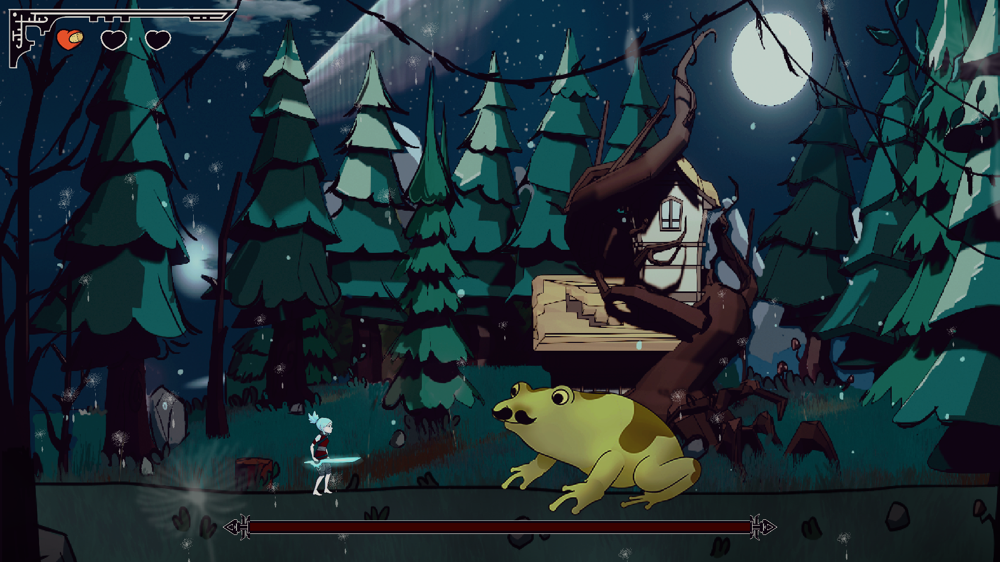
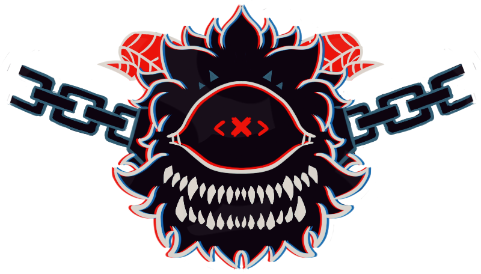

# VERDANT SORROW

***Documento de diseño de videojuego***

**Nombre de la empresa**: *Xuppap Inc.*

**Integrantes y correos**: *Daniel Martín Gómez (damart24@ucm.es), Miriam Martín Sánchez (mirima10@ucm.es), Javier Callejo Herrero (jacall02@ucm.es), Laura Gómez Bodego (lgomez25@ucm.es),  Nacho Del Castillo (igdelcas@ucm.es), Javier Muñoz García (javimuno@ucm.es), José María Gómez Pulido (jgomez18@ucm.es),Paula Morillas Alonso (pamorill@ucm.es), Rodrigo Sánchez Torres (rodsan05@ucm.es), Sergio Baña Marchante (sebana@ucm.es).  
Versión 1 - 30 de enero de 2022*

| Resumen||
:--: | :--: 
Géneros | Souls-Like, Acción, Aventuras, Boss-rush 
Modo | Single-player
Público Objetivo | Edad: 15-30 años
||Sexo: todos
||Idioma: español
Plataformas|Windows
---

**Tabla de contenidos**

1. [Aspectos generales](#aspectos-generales)   
    1.1. [Relato breve y parcial de una partida típica](#relato-breve)
2. [Jugabilidad](#jugabilidad)  
    2.1. [Mecánica](#mecanica)  
        2.1.1. [Mecánicas del personaje](#mecanicas-del-personaje)  
        2.1.2. [Mecánicas de enemigos](#mecanicas-de-enemigos)    
    2.2. [Controles](#controles)  
    2.3. [Cámara](#camara)  
    2.4. [Dinámica](#dinamica)  
    2.5. [Estética](#estetica)  
3. [Menús y modos de juego](#menus-y-modos-de-juego)  
    3.1. [Configuración](#configuracion)  
    3.2. [Interfaz y control](#interfaz-y-control)
4. [Breve descripción del sistema y plataforma de gestión](#descripion-del-sistema)  
5. [Contenido](#contenido)  
    5.1. [Música](#musica)  
    5.2. [Sonidos](#sonidos)  
    5.3. [Imágenes](#imagenes)  
    5.4. [Historia](#historia)  
    5.5. [Niveles](#niveles)   
6. [Referencias](#referencias)
___

## 1. Aspectos Generales

Vista General |
:--:|
|

###  1.1. Relato breve y parcial de una partida típica   
El jugador realiza el tutorial, lo que le enseña las mecánicas básicas tanto de movilidad como de ataque y desplazamiento. Además le enseña que puede matar moscas y atravesar raíces rodando, que serán lo primero que tendrá que hacer al comenzar el juego en los primeros jefes. 

Tras eso sale al hub, un gran espacio a modo de interfase global del juego en donde podrá hablar con distintos NPCs que explican la historia en profundidad en caso de hablar con todos ellos. Además de eso alguno de ellos le dará información sobre el primer jefe que tiene que enfrentar.

El jugador encuentra la zona en la que se encuentra la rana y entra para pelear contra ella. Al derrotarla sale al hub nuevamente para buscar el segundo objetivo, además, en el hub los NPCs tendrán nuevos diálogos que introducirán más al jugador en la historia del juego, y de igual manera que antes, uno de ellos le dará pistas y o consejos para enfrentarse al segundo jefe.

Tras encontrar y derrotar al segundo jefe el jugador vuelve a repetir el ciclo de hablar y buscar al tercero.

Al derrotar al tercer jefe el jugador debe escapar en un nivel de plataformas y obstáculos. 

Cuando haya llegado hasta la salida, el jugador se transportará directamente al hub, donde los NPCs le contarán el final de la historia y le felicitarán por su labor, y deberemos de proseguir hacia la puerta, en la parte superior del hub, donde, tras interaccionar con ella concluiremos el juego.

Se reproduce una cinemática final al abrir la puerta y se muestran los créditos del juego.

###  1.2. Duración esperada de una partida
El tiempo aproximado que debe durar una partida de un jugador sin experiencia previa en el juego se compondría de:

- El tiempo que tarda en realizar el tutorial: aproximadamente unos **3-5 min**.
- El tiempo de búsqueda del jefe en el hub, teniendo en cuenta la lectura de los diálogos para poder acceder al jefe: aproximadamente unos **3-5 min**. Un total de 3 veces: unos **10-15 min**
- El tiempo de batalla contra la rana: aproximadamente unos **3 min** de pelea, es probable que se necesiten varios intentos, aproximadamente **3 intentos**. Total: unos **10 min**.
- El tiempo de batalla contra el árbol: aproximadamente unos **3 min** de pelea, es probable que se necesiten varios intentos, aproximadamente **2-3 intentos**. Total: unos **8 min**.
- El tiempo de batalla contra el ojo con manos: aproximadamente unos **3 min** de pelea, es probable que se necesiten varios intentos, aproximadamente **4 intentos**. Total: unos **12 min**.
- El tiempo que se tarda en superar el nivel de huída tras el tercer jefe: aproximadamente **1 min**.
- El tiempo que dura la cinemática final y algún diálogo extra: aproximadamente **3 min**.

Total del juego: unos **45 min**, esta duración asume que el jugador lee diálogos y requiere varios intentos por jefe, además la vida de los jefes puede ser ajustable, por lo tanto una medida algo más realista sería: unos **15-20 minutos** sin leer muchos diálogos, unos **25-30 minutos** leyendo todos los diálogos. La habilidad del jugador influye de forma significativa en esta duración.

---  
##  2. Jugabilidad  
###  2.1. Mecánica 
###  2.1.1. Mecánicas del personaje  

-Movimiento: El jugador podrá moverse hacia la izquierda o la derecha con un movimiento lateral a velocidad constante. Además podrá saltar.  

-Movimiento top down: El jugador podrá moverse en **8 direcciones** en el hub.  

-Esquivar: El jugador podrá esquivar ataques, desplazándose una corta distancia y consiguiendo frames de invulnerabilidad durante la animación de esquivar.

-Ataque: El personaje dará un barrido hacia delante con la espada, en vertical, de forma que el ataque es un **arco de la altura del jugador**. Te quedas quieto cuando estés atacando. El ataque hace 1 de daño. El ataque se puede realizar también durante el salto. Tanto en el ataque en el suelo como en el aire el jugador puede encadenar varios de estos dando lugar a un combo.

-Vida: El jugador dispondrá de tres vidas, perdiendo una por cada golpe que reciba de un enemigo. Al recibir un golpe el jugador será impulsado hacia atrás y brillará en rojo. Durante unos segundos el jugador se volverá invulnerable a todo daño recibido.

-Hablar: En el hub, el jugador puede hablar con todos los personajes que hay en él, pudiendo obtener información que le ayude en sus enfrentamientos y además le contarán la historia del juego en profundidad.

###  2.1.2. Mecánicas de enemigos  

Comportamiento de los jefes: 
  - Jefe rana
      - Visual: Una rana grande y verde.
      - Primera fase:  
          - La rana va saltando de un lado a otro de la pantalla. Empieza saltando hacia la izquierda, calculando la distancia del salto aleatoriamente dentro de un intervalo.

          - La rana rebota con los bordes de la pantalla, en ese momento cambia la dirección del salto.

          - Ataque de la lengua: Cada X saltos(decidido aleatoriamente entre un intervalo), hace este ataque:
           
            - Aparece una mosca cerca del jugador, a una distancia determinada de la rana y a cierta altura sobre el suelo igual a la del jugador. Si la posición se saliera de la pantalla aparecería en la otra dirección. 
                            Pasados unos pocos segundos, la rana lanza la lengua hasta la posición de la mosca y hace daño al jugador en caso de impactarle. El movimiento de la lengua es siempre horizontal y tanto la "ida" como la "vuelta" son rápidas.

            - Si matas a la mosca se enfada y realiza un ataque, un salto sobre sí mismo, más alto que los normales y realizando una onda expansiva hacia ambos lados al caer. Tras este ataque se queda vulnerable durante un tiempo.

            - La onda expansiva se define como un proyectil que se mueve de forma horizontal desde la posición del boss hacia cada uno de los extremos de la pantalla, pegado al suelo a velocidad constante, de tamaño lo suficientemente pequeño para que pueda ser saltado por el jugador.

        - Segunda fase:
          - Mismo comportamiento que en la primera fase.

          - La rana se enfada y cambia de color a rojo así como la expresión de la cara, ahora ataca al jugador.

          - Añade un nuevo ataque en que los saltos son el doble de alto y cada uno causa una onda expansiva.

          - En cada salto la rana tiene un 70% de probabilidad de hacer saltos pequeños y un 30% de hacer saltos grandes.

          - El ataque de la lengua cambia, de tal manera que ahora no aparece ninguna mosca antes, atacando instantaneamente al jugador.

    - Árbol humanoide:
      - Visual: árbol con características antropomórficas que sostiene una lámpara y va cubierto por una capa.
      - Primera fase: 
        - Se va acercando hacia la posición x del jugador, y cuando está lo suficientemente cerca, da manotazo a melee (un arco frente al jefe de un alto igual al suyo mismo y similar al jugador), cuando lo hace se detiene brevemente en esa posición.

        - Ola de raíces: Tras un tiempo aleatorio en un intervalo, salen raíces del suelo progresivamente desde la posición del árbol hacia la que se encontraba el jugador cuando se inició este ataque. Estas raíces están separadas a la misma distancia cada una con un pequeño delay entre que sale una rama y otra. Cubriendo todo el alto de la pantalla. Antes de que salga una raíz, hay un indicador de una raíz más pequeña en la posición en la que va a salir la primera.

        - Ataque raíces con auto-aim: Cada X segundos, elegidos aleatoriamente dentro de un intervalo. El boss se sale de pantalla, la lámpara se queda en mitad del ancho de la pantalla, y lo suficientemente alta para que el jugador no llegue a atacarla. Las raíces del ataque anterior van saliendo en la posición del jugador cada X segundos, pero de manera singular, ya no a modo de ola sino en esa posición concreta. Si una de las raíces alcanza a la lámpara, se le hace mucho daño y se cambia a otro patrón de ataque.
        
      - Segunda fase: 
        - El boss ya no lleva la lámpara con él y pierde la capa que llevaba al inicio del combate. La lámpara aparece en un lado de la pantalla.

        - Cuando la lámpara recibe 3 golpes, cambia al otro lado de la pantalla. De forma que el boss siempre está al principio entre la lámpara y el jugador. Esto se repite 3-4 veces.

        - Al igual que en la primera fase, el boss persigue al jugador, y cuando lo tiene a rango, le pega un manotazo.

        - El ataque de raíces con auto-aim se realiza constantemente. Si la raíz sale cerca de la lámpara se cancela (el jefe no le pega a su lámpara).

    - Jefe de las manos: 
      - Visual: Una cabeza gigante encadenada, de aspecto demoníaco y un solo ojo que ataca con 2 manos gigantes.       
  
        

    -Primera fase:
    
      - La cabeza es la única parte de este boss que recibe daño mientras que las manos son inmunes.
      - Hay que subirse a las manos para atacar al cuerpo principal puesto que la cabeza flota a una altura a la que el jugador no llega saltando.  
      - Las manos hacen daño sólo durante el ataque.
      
      - Tres ataques:
        - Clap: ambas manos se desplazan desde los laterales del boss a los extremos de la pantalla pero a la altura del suelo y se juntan rápidamente hacia el centro.

        - Puñetazo: Una de las dos manos se desplaza hacia el fondo, en la posición del jugador e instantes después se hace grande a modo de puñetazo.

        - Martillazo: Una de las manos se eleva sobre la posición del jugador y después desciende rápidamente. Cuando impacta en el suelo crea una onda expansiva hacia             ambos laterales de la pantalla.     
     

      - Segunda fase:
        - El boss se desencadena y comienza a moverse por la pantalla, rebotando con el suelo y los laterales de la pantalla.

        - Los ataques continuan siendo los mismos y de la misma manera, con la diferencia de que ahora las manos hacen daño constantemente puesto que se encuentran                 prendidas en fuego.

        - El movimiento del cuerpo del boss es el siguiente: <a ref="https://www.youtube.com/watch?v=5mGuCdlCcNMMovimiento">Movimiento</a>

        - Cuando la cabeza choca contra el suelo lanza una bola de fuego a cada lado y se queda inmóvil unos segundos.

        - Cada X tiempo lanza una bola de fuego hacia el jugador, que desaparece al chocar con un lateral de la pantalla o el suelo.

      - Tercera fase:
        - Ahora el enemigo te persigue a través de un nivel de plataformeo y es invulnerable en todo momento al daño, pero si te alcanza te elimina todas las vidas.
        
       
###  2.2. Controles  
El jugador se controla con las teclas WASD del teclado (W se utiliza para saltar, al igual que la tecla Espacio, A y D para el movimiento lateral). Se atacará con la tecla J, y se esquivará con el Shift izquierdo.
El jugador, dentro del Hub, puede hablar con los NPCs que encuentre pulsando la tecla "E".

  

###  2.3. Cámara  
La cámara estará posicionada de modo que se muestre una vista lateral del personaje y del escenario. Según el jugador vaya avanzando, la cámara lo seguirá con un cierto delay haciendo scroll, con el jugador siempre centrado en la cámara. 
En las peleas con los jefes la cámara está fija en el centro porque las zonas de combate ocupan una pantalla únicamente.

###  2.4. Dinámica  
- Objetivo: Avanzar a través de las diferentes zonas venciendo a los 3 jefes para abrir la puerta central.  

- Ganar: Acabar con el jefe actual, sería una victoria parcial. Superar los 3 bosses y llegar al final del juego sería una victoria total.

- Recompensa: Nuevos caminos en el hub, nuevos diálogos y jefe.

- Perder: Morir en combate contra los jefes o en el nivel de huída.

- Castigo: Volver al hub y tener que comenzar de nuevo el jefe, volver a comenzar el nivel de huída lateral o el vertical.

###  2.5. Estética

  
  

  

  
Se busca una estética inspirada principalmente en “Más allá del jardín”. Dibujos infantiles pero con una tonalidad oscura que nos puede recordar también a la estética de Tim Burton. Los personajes, enemigos y objetos con los que interactúa el jugador tendrán tonos con más saturación para poder distinguirlos del fondo. Todo el arte tendrá lineart negro, exceptuando zonas muy alejadas del fondo. En ciertos momentos se usará una composición uniforme con un elemento contrastado para captar la atención del jugador (por ejemplo cuando el jefe de la linterna sale de la pantalla la linterna contrasta con todo lo demás).
De la misma manera, para que el jugador tenga conciencia de los cambios que se producen en los jefes se añade un sistema de partículas. Estos, además de reflejar el cambio de fases dentro de las luchas contra los jefes, también proporcionan al jugador una ayuda visual a la hora de identificar distintos ataques, tanto propios como enemigos así como el inicio y la finalización de los mismos.

Esta será la paleta de colores que se utilizará.
 

  

---

##  3. Menús y modos de juego
###  3.1. Configuración

- Menú principal: Cuenta con los siguientes botones:
    - Nueva partida: Comienza una nueva partida.
    - Continuar: Continúa el juego en el último punto de guardado.
   -  Controles: Muestra una pantalla con los controles del juego.
   -  Salir: Permite salir del juego.
 
 - Menú de pausa: Cuenta con los siguientes botones:
    - Reanudar nivel: Permite reanudar la partida.
    - Ajustes: Permite regular el volumen de salida de audio.
    - Salir al menú principal: Permite volver al menú principal.
    - Salir : Permite cerrar el juego sin tener que salir al menú principal.

 Al utilizar las opciones de salir, el juego guardará el estado desde el último punto de guardado.

 ###  3.2. Interfaz y control  
 La interfaz será una interfaz sencilla; contendrá 3 corazones que representan la vida del jugador. Cuando entra en cualquier enfrentamiento contra un jefe aparecerá en la parte inferior, sin obstaculizar la visibilidad de los elementos del juego, la barra de vida del jefe en cuestión.

 

  

---

 ##  4. Breve descripción del sistema y plataforma de gestión  
 Utilizaremos GitHub Issues como sistema de gestión, cada historia de usuario se escribirá como una issue y los responsables se la asignarán.  

 ### 4.1. Breve descripción del sistema y plataforma de comunicación 
Utilizaremos medios como Discord y/o WhatsApp para la comunicación efectiva entre todo el equipo y para acordar fechas y horas de reunión para aclarar dudas y          posibles conflictos. De la misma manera Discord se utilizará para una comunicación más enfocada al proyecto de manera seria, con diversos canales que se usen para      las distintas áreas del proyecto así como para las reuniones de todo el equipo una vez al comienzo de semana para organizar el trabajo de cara a la siguiente.
     El grupo de whatsapp será para un uso más coloquial y distendido.

---

  ##  5. Contenido  
  ###  5.1. Música 
     
En el apartado de la música, al igual que en el apartado de arte queremos que sean de creación propia, de tal manera que encaje con el estilo de juego que estamos      buscando la música será también un aliciente para el jugador y acompañará con el estado de juego en ese momento, de tal manera que la música en el hub, el              lugar donde nada te hace daño y puedes explorar tranquilamente, será una música tranquila, mientras que en los combates contra los jefes la música será mucho          más rápida, y en la segunda fase de cada uno, frenética.
     
     
  - Música de cada uno de los jefes tanto para la primera como para la segunda fase.
  - Música menú y del Hub. 

  ###  5.2. Sonidos
     
Los distintos sonidos que habrá en el juego serán los siguientes:
     
  - Jugador
    - Ataque con la espada
    - Salto
    - Rodar 
  
  - General
    - GameOver
    - Derrotar Boss
     
  - Jefes:
     -Ataques

  ###  5.3. Imágenes
     
Como indicábamos al principio del documento, la casi totalidad de nuestro juego contaría con arte hecho por nuestro equipo, de tal manera que tanto los fondos del      juego como las distintas animaciones de nuestro personaje y de los enemigos encajasen perfectamente en el juego y a nuestro gusto.
     
De tal manera se crean las siguientes animaciones:
     
  - Personaje principal:
    - Correr
    - Saltar
    - Atacar (en suelo)
    - Atacar (en aire)
    - Rodar  
  
    

  - Boss rana:
    - Rana idle
    - Rana saltando
    - Rana sacando lengua
    - Rana vulnerable  

    
    

  - Boss humanoide:
    - Idle
    - Caminar
    - Golpear

      
      
    

  - Boss manos:
    - Mano abierta/puño
    - Ojo central gigante

     

  ###  5.4. Historia  
  Durante los últimos milenios, el mundo de Arven vio cómo los poderes naturales que daban la noción de equilibrio al propio planeta y ayudaban a sus habitantes a prosperar y estar en armonía con el mundo mismo, iban pervirtiendose y transformándose en una mágica distinta, más egoísta, impersonal y codiciosa.  

  Las tres esencias primordiales del mundo y sus custodios se refugiaron en un bosque ancestral, un bosque sin nombre, donde los habitantes de este planeta vieron su luz por primera vez.  

  Terria, la esencia de toda la materia.  

  Lumine, la esencia de la luz y la vida.  

  Etheria, la esencia que constituye la voluntad y la mente.  

  El uso incontrolado de esta magia acabó con la paz que imperaba en el mundo, resultando en guerras por el control de sus terrenos y en rituales para succionar las energías primordiales y transformarlas en esta nueva magia arcana, si bien más poderosa, también destructiva en su descontrol.  

  Así pasó que, cuando desde diversos puntos del mundo la succión de la esencia del mundo fue desmedida e incontrolada, la magia que otrora sirviera a los propósitos de sus habitantes implosionó de manera global, borrando de la superficie todo cuando encontró a su paso, nada que hubiera tocado la magia sobrevivió.  

  Con este devastador suceso, tan solo los custodios de las esencias sobrevivieron, más no como ellos esperaban, sus nombres se olvidaron y su apariencia cambió, pasando a ser criaturas grotescas y furibundas cuyo único propósito es ahora ser las carceleras de las fuerzas primordiales.  

  El custodio de Terria se transformó en una gigantesca rana que consume todo cuanto está a su alcance.  

  El de Lumine se convirtió en un árbol viviente que encarceló la esencia de la luz en una lámpara cerrada.  

  Por último, el de Etheria acabó por transformarse en un ser informe sin mente, una masa de materia en continua alteración, salvo por su único ojo y sus dos gigantescas manos que arremeten contra todo aquello que ve.

  Para traer de vuelta el equilibrio, el propio mundo ha canalizado sus fuerzas y dado vida a su avatar, Kyna con la esperanza de que este reúna las 3 esencias primordiales.  
     
 **Desarrollo de la Historia hacia el jugador**
     
  Al comenzar el juego, se le mostrará al jugador el grueso de la historia, el por qué está ahí y cual es el argumento que lo rodea. Decimos que se le cuenta el grueso pero no el total, puesto que a lo largo del juego a medida que hable con los NPCs del Hub estos, le informarán de manera progresiva de todo lo que ha pasado, qué fue lo que llevó al mundo de Arven a su estado actual, qué se espera de él y distintos detalles argumentales para dar sensación de una historia de la que el jugador es partícipe y pieza clave.
     
  Siendo así, se le mostrará la historia en la fase de tutorial, en su exploración del hub a medida que avance puesto que los NPCs le irán contando distintas partes del argumento en función de los bosses que haya superado y por último al finalizar el juego, cuando reúna las esencias de los 3 bosses sirviendo de cierre al mismo.

 ###  5.5. Niveles  
     
La progresión a lo largo del juego, si se distribuye en niveles, esquemáticamente sería la siguiente:
     
- Tutorial: Se le muestran al jugador los controles de los que tendrá que hacer uso a lo largo del juego, así como se le expondrán las mecánicas de las que tendrá que hacer uso y la dinámica general del juego, lo que incluye también un NPC con el cual interactúe.

- Hub: Esta será la zona más amplia del juego con una vista "Top/Down" en la cual el jugador puede desplazarse libremente dentro de los límites, hablando con los NPCs que encuentre en él, los cuales le darán, bien información relacionada con el lore para que el jugador tenga conciencia de la historia que le rodea, bien de los bosses a los que tendrá que enfrentarse. En este Hub el jugador también encontrará las entradas a los distintos bosses, entradas que se irán desbloqueando progresivamente, dado que el orden de enfrentamiento a estos es inalterable.

- Boss Rana: [Mecanicas de enemigos](#mecanicas-de-enemigos)

- Retorno al Hub: el jugador vuelve al hub notando cambios en el mismo, como que la entrada al primer boss está destruida, la puerta de las 3 esencias al norte del hub tiene la primera marca iluminada y los NPCs con los que puede interactuar le darán información distinta a la que le dieron al principio.

- Boss Árbol: [Mecanicas de enemigos](#mecanicas-de-enemigos)

- Retorno al Hub: el jugador vuelve al hub por segunda vez notando cambios similares a los primeros puesto que ahora las entradas a los dos primeros bosses están destruidas y los dos simbolos correspondientes en la puerta al norte del hub están iluminados a falta del tercero. Los NPCs del hub de nuevo le darán información distinta a la que ya le dieron las veces anteriores.

- Boss Manos: [Mecanicas de enemigos](#mecanicas-de-enemigos)
     
- Nivel de Huída: Cuando la salud del tercer jefe llega a 0, el jugador pasará automáticamente a un nivel de huída, basado en plataformeo y obstáculos que esquivar. En este nivel el jugador mediante saltos y coordinación tiene que avanzar en un primer momento, de manera horizontal saltando de plataforma en plataforma, esquivando los proyectiles que le arrojan algunas plantas, evitando pinchos distribuidos a lo largo del nivel, y no menos importante, evitando caer al vacío. Todo esto mientras la sombra del último boss te persigue.
Cuando llegamos a la mitad del nivel, habrá un checkpoint para evitar penalizar al jugador de más si llega a este punto en caso de morir, y la dinámica del nivel se mantendrá, variando solo de la horizontalidad a la verticalidad.
Al llegar a la salida de esta fase vertical pasaremos directamente al Hub.

- Retorno al Hub: el jugador vuelve directamente al Hub tras derrotar al tercer boss y escapar. Ahora todas las entradas están destruidas, los NPCs le dan las últimas piezas de información de la historia detrás de toda su aventura y le instan a ir hacia la puerta, la cual tiene iluminados los 3 símbolos de las esencias. El jugador interactuará con ella y se le muestra la descripción del desenlace del juego y de las buenas consecuencias que sus actos traerán al mundo de Arven, siendo así el final del juego.

  |  
     
  Tutorial de ataque usar moscas, de esta forma al llegar al boss de la rana sabrá que puede golpear a las moscas.  
  | 
     
  
     
     

---

##  6. Referencias  

- Estética basada en “Más allá del jardín”, Pat McHale.  

- Dark Souls, FromSoftware, BANDAI NAMCO.  

- Ender lilies, Adglobe, Live Wire,Binary Haze Interactive.  

- Hollow Knight, Team Cherry Games.  

- Morbid, Still Running, Merge Games  

- Cuphead, Studio MDHR Entertainment Inc.  

- Titan Souls, Acid Nerve, Devolver Digital.

- Dead cells, Motion Twin.  

- Blasphemous, The Game Kitchen, Team17.  

- Death Door, Acid Nerve, Devolver Digital.  

- Salt and Sanctuary, Ska Studios.

---

https://github.com/Xuppap-Inc/VerdantSorrow

